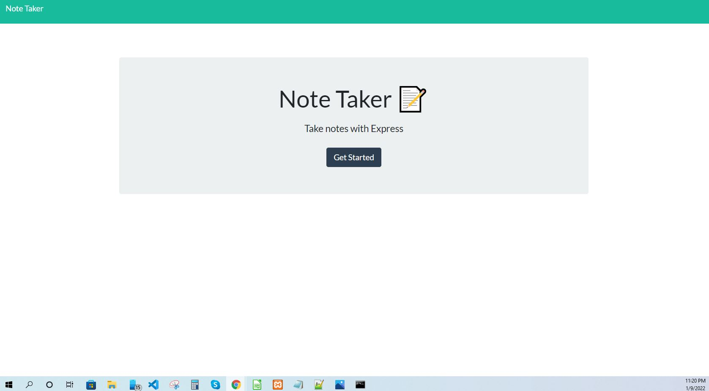
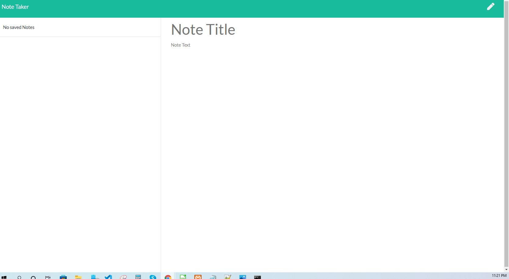
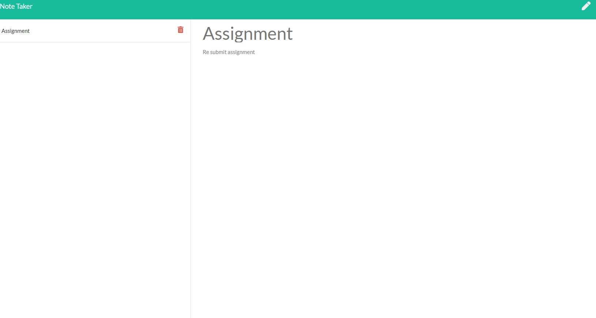

# Note-Taker


# Description :

This is a simple Note Taker application that allows users to add, view saved notes and also delete the notes 
if the user don't need that note anymore. This application uses an express backend and save and retrieve note
data from a JSON file.


## Deployed Application :

* https://github.com/bokigolic/note-taker


# Contents :

* [Demo](#general-info)
* [Technologies](#technologies)
* [Usage](#usage)
* [Features](#features)
* [Licence](#licence)
* [Contibution](#contibution)


# Demo


# Application Preview : 

|Main Page|Saved Notes|Delete Note
|--|--|--
|||


# Technology :
1. Express.js :

* Web Applications : Express is a minimal and flexible Node.js web application framework that 
  provides a robust set of features for web and mobile applications.

* APIs : With a myriad of HTTP utility methods and middleware, creating a robust API is quick and easy.

* Performance : Express provides a thin layer of fundamental web application features, without obscuring Node.js features.

2. Node.js :

* Node.js is an open-source and cross-platform JavaScript runtime environment.

* A Node.js app is run in a single process, without creating a new thread for every request.

* Node.js provides a set of asynchronous I/O primitives in its standard library that prevent JavaScript code from blocking.

3. uuid : Creates random unique id's.


# Usage :

* Clone this repository to use this application on local machine.

* To install necessary dependencies, run the following command :


```
npm i
```

* The application will be invoked with the following command: This will start localhost server on PORT 3000.

```
node server.js
```


* Open browser and type http://localhost:3000/ to run this application on your local machine.


# Licence:

This project is licensed under MIT license.

# Questions:

If you have any questions about the repo, contact me directly at [Email](bokigolic32@gmail.com)


